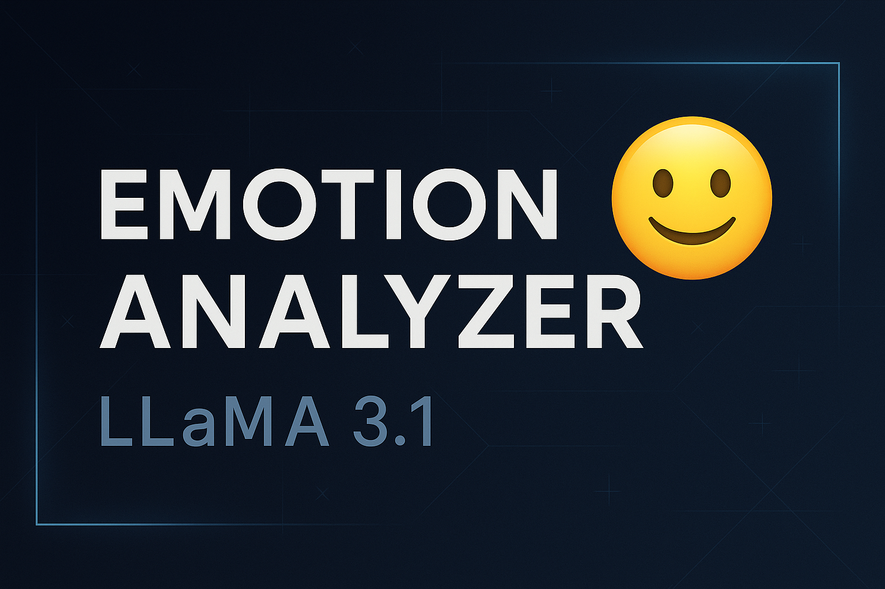

# Emotion Analyzer — LLaMA 3.1 (Enhanced NLP Project)

This project implements an advanced **Emotion Classification System** powered by **LLaMA 3.1**, running fully locally via **Ollama**.  
It analyzes any text (short or long) and returns:

- the **dominant emotion**
- a **confidence score**
- the **top 3 emotion predictions**
- emoji-enhanced output
- automatic logging to `emotion_history.txt`
- stabilized JSON parsing

Perfect for:

- NLP portfolios
- AI engineering interviews
- ML/NLP demonstration projects
- local, private text analysis

---

## 🚀 Features

### ✔ **7-Class Emotion Model**

Detected emotions:

- joy 😊
- sadness 😢
- anger 😡
- fear 😨
- surprise 😲
- disgust 🤢
- neutral 😐

### ✔ **Enhanced Prompt Engineering**

Uses detailed emotion definitions and strict JSON structure to reduce hallucinations.

### ✔ **Top-3 Emotion Ranking**

Shows the 3 most probable emotional tones with scores.

### ✔ **Safe JSON Normalization**

Automatically fixes malformed JSON returned by the model.

### ✔ **Multiline Text Input**

Paste long texts (articles, essays, stories).  
Finish input with **one empty line**.

### ✔ **Logging**

Every analysis is saved in:
